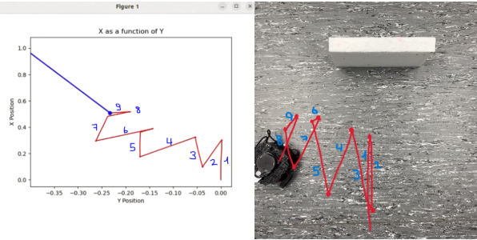
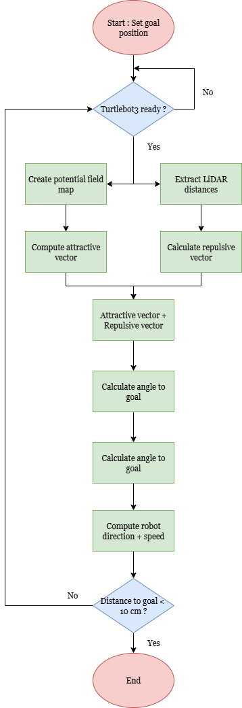

In this project, me and my dear colleague  <a href="https://fr.linkedin.com/in/gio-so-7785a8341">Gio So</a> designed, implemented, and evaluated an autonomous navigation system on a TurtleBot 3 (Fig. 1) using ROS 2. Starting from a detailed study of ROS 2, mobile-robot concepts, and differential-drive navigation, we developed three successive prototypes—ranging from basic obstacle detection to full SLAM‑and‑Nav2‑based navigation. Each prototype refined the communication between the Raspberry Pi 4 (RPi) and the OpenCR microcontroller, introduced an Artificial Potential Field (APF) path‑planning algorithm, and culminated in leveraging Nav2 for industrial‑grade autonomous navigation.

<figure style="max-width:800px; margin:0 auto; text-align:center;">
  
  <figcaption><em>Figure 1.</em> Turtlebot 3 Burger components.</figcaption>
</figure>

## Objectives
- Master ROS 2 concepts (nodes, topics, QoS, actions) and both C++ and Python for robotics software 
- Implement a dynamic trajectory‑planning algorithm (APF) on an AMR with modular, real‑time execution
- Develop three incremental prototypes, each adding complexity (from simple LiDAR‑based stopping to SLAM + Nav2) 
- Deliverables: a fully programmed AMR with clear instructions; ROS 2 packages (C++ & Python) for autonomous control 

## Communication Method

At first, we established a simple serial protocol: LiDAR distances were sent as ASCII frames from the Pi to the OpenCR, which parsed each line to drive the robot’s wheels. As the project evolved, we expanded the protocol to include full LiDAR scans and encoder odometry, then replaced it entirely by running micro‑ROS on the OpenCR. This allowed seamless publication and subscription of native ROS 2 messages (/scan, /odom, /cmd_vel), eliminating custom parsing and improving latency.

## Navigation Method

The core of our custom planner was an Artificial Potential Field: goal attraction and obstacle repulsion vectors were computed in real time to generate velocity commands. Although this approach handled dynamic avoidance without a map, we observed the classic APF drawbacks of local minima and oscillatory motions (Fig. 2). 

<figure style="max-width:800px; margin:0 auto; text-align:center;">
  
  <figcaption><em>Figure 2.</em> APF Failure (goal = behind the box).</figcaption>
</figure>

To overcome these, we later adopted the Nav2 stack—using SLAM‑generated maps, layered costmaps, and global/local planners—to produce smooth, collision‑free trajectories in complex environments.

## Practical Implementation

Prototype 1 filtered a 60° LiDAR sector on the Pi, sent distances over serial to the OpenCR, and halted the robot before obstacles. 

<figure style="max-width:800px; margin:0 auto; text-align:center;">
  
  <figcaption><em>Figure 3.</em> First prototype visualization.</figcaption>
</figure>

Prototype 2 moved APF calculations onto the Pi under ROS 2, reading complete scans and odometry and publishing velocity commands back to the OpenCR, the workflow is described in ths following Figure.

<figure style="max-width:800px; margin:0 auto; text-align:center;">
  
  <figcaption><em>Figure '.</em> Second protoype workflow.</figcaption>
</figure>

In Prototype 3, we ran Cartographer SLAM on the TurtleBot, launched Nav2 with tuned costmap parameters, and flashed micro‑ROS firmware to the OpenCR so that /cmd_vel and sensor topics flowed natively between both controllers. 

## Results

I won't talk too much about this prototype because we used a bunch of libraries for the implementation of each navigation component, so it really is not from scratch like the two that came beforehand. But it did teach us a valuable lesson : implementing from scratch components (such as prototype 1 and 2) is recommended for learning purposes, but for industrial use cases, where time is of the essence, using more robust, well-known methods is still the better approach. 

In early tests, the robot reliably stopped for frontal obstacles but exhibited jerky starts and stops due to serial delays. The APF version reached goals in obstacle‐free runs but oscillated when avoiding obstacles. Finally, with Nav2, the TurtleBot navigated smoothly around both static and moving obstacles, demonstrating industrial‑grade performance and validating the effectiveness of SLAM‑and‑Nav2 over a pure APF approach.

## What's next

To advance this work, we planned to explore AI‑enhanced planners—such as reinforcement‑learning or deep‐network‑based potential fields—to eliminate APF’s local minima issues. It is also possible to integrate additional sensors (camera, IMU) for 3D mapping and semantic perception, and investigate multi‑robot coordination using ROS 2’s DDS capabilities. Ultimately, this was in invaluable project which helped me and my colleague grow as individuals.
