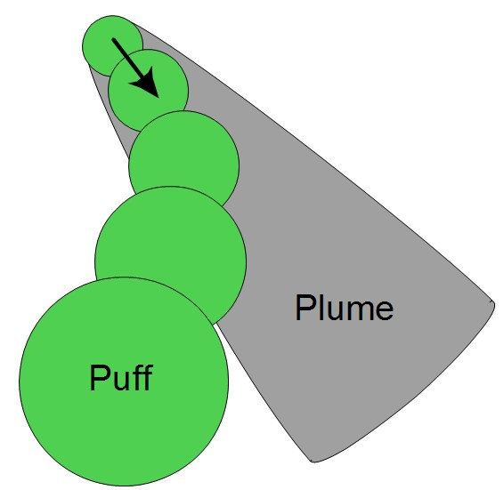
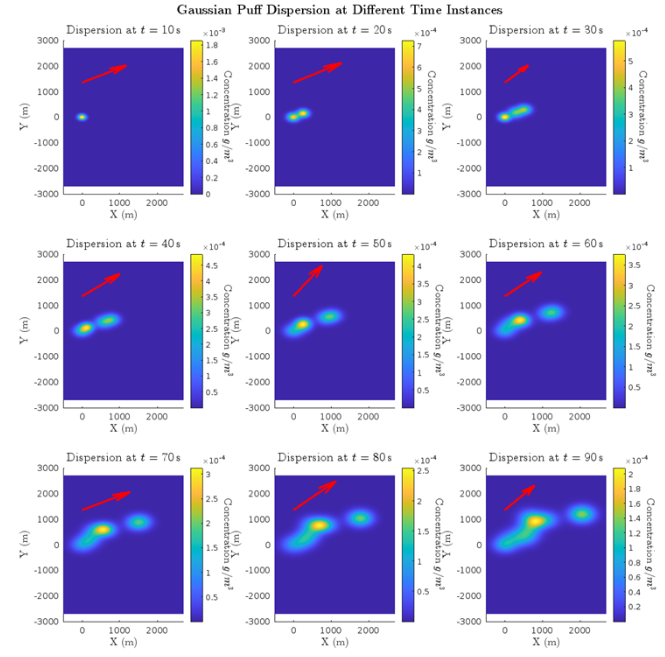
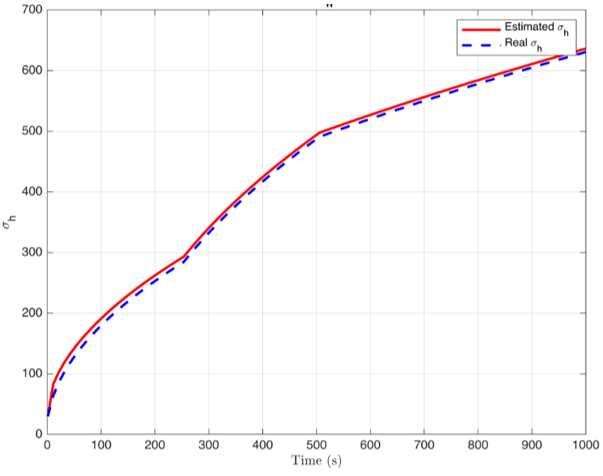

## Summary

I presented a complete pipeline for modeling and estimating the behavior of a three‑dimensional smoke plume released into the atmosphere. The plume is represented as a sequence of Gaussian “puffs,” each carrying a fixed mass and spreading according to atmospheric dispersion coefficients. An Extended Kalman Filter (EKF) then fuses sparse concentration measurements to recover each puff’s center position and spread parameters in real time. The entire workflow is implemented in a MATLAB Live Script, enabling interactive visualization of both simulation and estimation results!

## Objectives

- Develop a 3D Gaussian‑puff model that captures transient plume dispersion under varying wind and stability conditions.
- Formulate a nonlinear state‑space representation of puff dynamics suitable for recursive estimation.
- Design and tune an EKF to estimate each puff’s standard deviations (horizontal and vertical) and centroid from noisy (simulated) measurements.
- Implement the entire pipeline in a MATLAB Live Script, with interactive plots for dynamic analysis.
- Validate estimator performance against noisy synthetic data and quantify estimation errors.

## Modeling Method: Gaussian Puffs

The problem with modeling the smoke plume as a single steady‑state entity (Gaussian Plume, Fig. 1) is that it cannot capture rapid changes in ambient temperature, humidity, wind direction, etc.

<figure style="max-width:800px; margin:0 auto; text-align:center;">
  
  <figcaption><em>Figure 1.</em> Gaussian Plume vs. Puff modeling of a smoke plume.</figcaption>
</figure>

A more dynamic solution is to discretize the plume into individual puffs emitted at fixed intervals. Each puff’s concentration field is  

$$
C_i(x,y,z,t)
= \frac{Q_{p,i}}{(2\pi)^{3/2}\,\sigma_h^2\,\sigma_v}
\exp\!\Bigl(-\tfrac12\frac{(x - x_{c,i}(t))^2 + (y - y_{c,i}(t))^2}{\sigma_h^2}\Bigr)
\;\times\;
\exp\!\Bigl(-\tfrac12\frac{(z - z_{c,i}(t))^2 + (z + z_{c,i}(t))^2}{\sigma_v^2}\Bigr)
$$  

where $(x,y,z)$ are the evaluation point, $(x_{c,i},y_{c,i},z_{c,i})$ is the puff center, $\sigma_h,\sigma_v$ are the time‑varying spreads, and $Q_{p,i}$ is the puff’s mass. Summing over all $N$ puffs gives the full plume:

$$
C(x,y,z,t) = \sum_{i=1}^N C_i(x,y,z,t)\,.
$$

## Estimation Method: Extended Kalman Filter

Each puff’s state vector  
$$
\mathbf{x}_k = [\,x_c,\,y_c,\,z_c,\,\sigma_h,\,\sigma_v\,]^T
$$  
 
evolves via  
 
$$
\mathbf{x}_{k+1} = f(\mathbf{x}_k) + \mathbf{w}_k,\quad
\mathbf{y}_k = g(\mathbf{x}_k) + \mathbf{v}_k\,.
$$  
The EKF alternates between:

**Predict** 

$$
\hat{\mathbf{x}}_{k+1\mid k} = f(\hat{\mathbf{x}}_{k\mid k}), 
\quad
P_{k+1\mid k} = F_k\,P_{k\mid k}\,F_k^T + Q
$$

**Update** 

$$
K_{k+1} = P_{k+1\mid k}\,G_{k+1}^T\,(G_{k+1}\,P_{k+1\mid k}\,G_{k+1}^T + R)^{-1},
\quad
\hat{\mathbf{x}}_{k+1\mid k+1} = \hat{\mathbf{x}}_{k+1\mid k} + K_{k+1}\bigl(\mathbf{y}_{k+1} - g(\hat{\mathbf{x}}_{k+1\mid k})\bigr)
$$

where $\mathbf{F_k}$ and $\mathbf{G_{k+1}}$ are the Jacobians of $f$ and $g$, and $Q,R$ the noise covariances.

## Implementation

All steps—from puff generation to EKF recursion—live in a single MATLAB Live Script. First, wind speed, stability class and dispersion coefficients are set. A time loop creates new puffs, builds 3D concentration grids, and plots them. The EKF predict/update use symbolic Jacobians turned into MATLAB functions, and interactive figures update to show true vs. estimated puff centers, spreads, and measured vs. reconstructed concentrations.

## Results

The 3D plume evolution is visualized with successive slice plots (Fig. 2). The EKF‑estimated horizontal spread $\sigma_h$ tracks the true value closely (Fig. 3), with RMSE < 5 %. Estimated concentration curves align with noisy sensor data, cutting bias while keeping each EKF step under 1 ms. The Live Script processes hundreds of puffs and updates in just a few seconds.

<figure style="max-width:800px; margin:0 auto; text-align:center;">
  
  <figcaption><em>Figure 2.</em> Puff evolution over time.</figcaption>
</figure>

<figure style="max-width:800px; margin:0 auto; text-align:center;">
  
  <figcaption><em>Figure 3.</em> Horizontal spread estimation for one puff.</figcaption>
</figure>

## What’s Next?

Future steps include fusing data from multiple sensors to improve observability, extending the puff model with buoyancy and chemical reactions, conducting field trials to calibrate dispersion coefficients, and porting core routines to C/C++ for on‑site real‑time monitoring.
