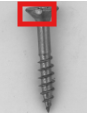
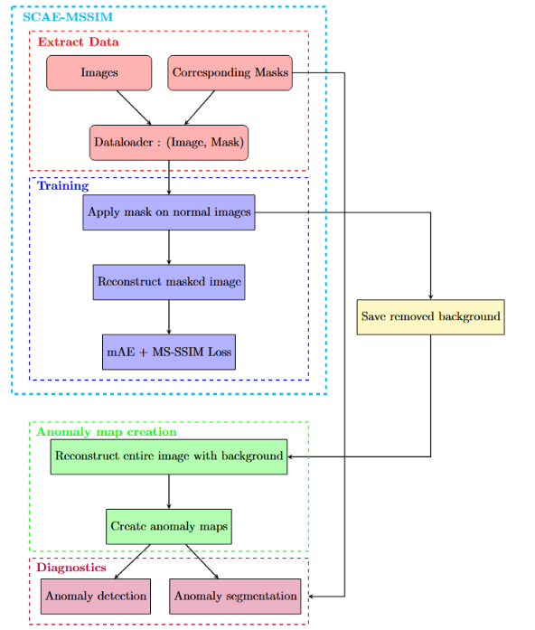
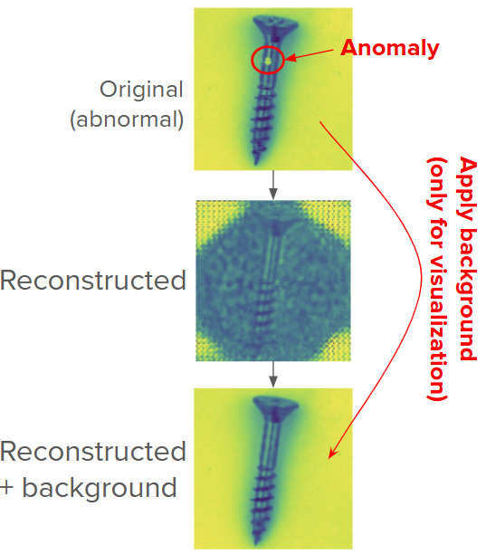
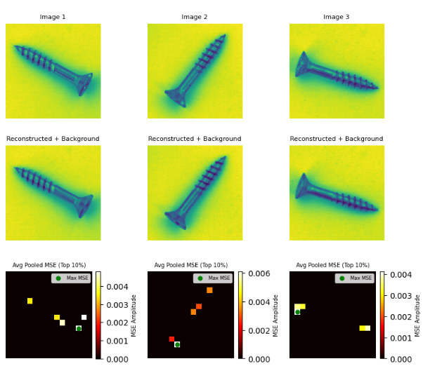
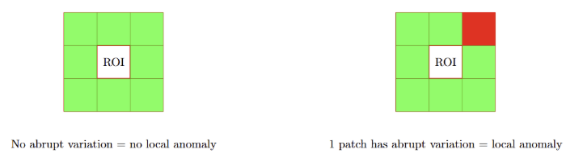
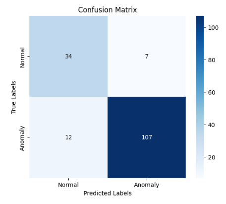
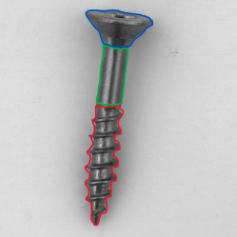

This project addresses the detection of subtle defects in industrial images using a convolutional autoencoder trained with a multi-scale SSIM loss (SCAE-MSSIM). By learning exclusively from good samples of the object of interest (segmented from the MVTec dataset), the model reconstructs defect-free regions while ignoring background variations. Traditional thresholding methods struggle to detect small defects because they compute anomaly scores over the entire image, so small flaws are lost amid background noise. Focusing reconstruction and error analysis solely on the segmented object region enables the model to reveal minute anomalies that would otherwise evade conventional statistical or edge-based detectors.

<figure style="max-width:800px; margin:0 auto; text-align:center;">
  
  <figcaption><em>Figure 1.</em> Example of a subtle anomaly.</figcaption>
</figure>

<h2>Objectives</h2>

The main goals were to master deep-learning frameworks (PyTorch, TensorFlow) for image reconstruction, to design a lightweight autoencoder capable of highlighting both minute and structural defects with over 90 % accuracy, and to produce well-documented Jupyter notebooks for easy reuse. A secondary aim was to compare reconstruction-based and segmentation-augmented approaches under a unified benchmark.

<h2>Global Method</h2>

A two-stage approach was implemented (<em>Fig. 2</em> for global method):

<figure style="max-width:800px; margin:0 auto 1.5em; text-align:center;">
  
  <figcaption><em>Figure 2.</em> Global method visualization.</figcaption>
</figure>

<strong>Convolutional Autoencoder (CAE-MSSIM):</strong> A symmetric encoder–decoder network compresses each input patch and reconstructs it, with the loss function combining mean squared error and multi-scale SSIM (similarity index) to preserve fine textures. The reconstruction is focused on the area of interest (the screw in this case). After training on defect-free samples, reconstruction residuals accentuate anomalies with an anomaly map (<em>Fig. 3</em>), where the anomaly is not reconstructed at all and thus produces a much higher reconstruction error in that zone.

<figure style="max-width:800px; margin:0 auto 1.5em; text-align:center;">
  
  <figcaption><em>Figure 3.</em> Visualization of the reconstruction method.</figcaption>
</figure>

<strong>Segmentation-guided anomaly mapping:</strong> This augments the autoencoder with a lightweight segmentation head that produces per-patch error scores strictly over the object region. We first select the top 10 % of patches with the highest reconstruction error (<em>Fig. 4</em>). For each candidate patch, we then compute the difference between its error and the errors of its immediate neighbors (<em>Fig. 5</em>). A patch is marked as anomalous whenever this error deviation exceeds <b>\( \pm 3\sigma \)</b>, where <b>\( \sigma \)</b> is the standard deviation of the reconstruction error measured on the defect-free training set.

<figure style="max-width:800px; margin:0 auto 1.5em; text-align:center;">
  
  <figcaption><em>Figure 4.</em> 10 % of errors in area of interest.</figcaption>
</figure>

<figure style="max-width:800px; margin:0 auto 1.5em; text-align:center;">
  
  <figcaption><em>Figure 5.</em> Error variation with neighboring patches.</figcaption>
</figure>

<h2>Results</h2>

The CAE-MSSIM model achieved high-fidelity reconstructions on pristine images while consistently under-reconstructing defect regions. Anomaly maps derived from the residuals correctly highlighted hairline scratches and surface pitting, which standard edge detectors missed. Applying a dynamic threshold to the anomaly maps further reduced false positives in textured areas, boosting detection precision without sacrificing recall. Overall, the approach delivered slightly under 90 % detection accuracy (<em>Fig. 6</em>) on held-out validation patches, with inference times suitable for near-real-time inspection (0.6 seconds per inference).

<figure style="max-width:800px; margin:0 auto 1.5em; text-align:center;">
  
  <figcaption><em>Figure 6.</em> Confusion matrix (88 % accuracy).</figcaption>
</figure>

<h2>What's Next?</h2>

Future work will explore learnable, context-aware thresholding schemes—perhaps via a small auxiliary network—to further adapt to varying backgrounds. Expanding to color images and integrating attention mechanisms could improve sensitivity to contrast-low defects. Working on a better, zone-dependent anomaly detection approach was also considered, where each zone of an object of interest would have its own threshold, allowing the model to compensate for reconstruction imperfections (even on good samples). This idea, however, was not fully implemented (<em>Fig. 7</em>). Finally, benchmarking against GAN-based contour detectors will quantify the relative merits of reconstruction vs. generative approaches before combining both paradigms in a hybrid pipeline.

<figure style="max-width:800px; margin:0 auto; text-align:center;">
  
  <figcaption><em>Figure 7.</em> Zone dependent segmentation.</figcaption>
</figure>

