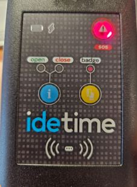

This internship project demonstrated the feasibility of fully on-device fall detection on the STM32L4-based iDETime badge, combining a tailor-made signal-processing pipeline, lightweight feature extraction, and real-time inference of a TinyML model under a strict 320 KB RAM budget.

<h2>Objectives</h2>

The work began with a clear set of goals: Benchmark and compare different AI code-generation frameworks for embedded deployment; design an efficient sliding-window and interpolation pipeline to extract robust time-domain features; apply a multiobjective optimization strategy to balance predictive accuracy, memory footprint, and inference latency; and finally generate C libraries for seamless integration and profiling on the device in real-time (FreeRTOS).

<h2>Method</h2>

<figure style="max-width:800px; margin:0 auto 1.5em; text-align:center;">
  
  <figcaption><em>Figure 1.</em> Overview of the signal-processing and TinyML pipeline.</figcaption>
</figure>

A bit more detail on the multiobjective Bayesian optimization: I chose to optimize 3 cost functions at the same time (balanced accuracy, model complexity, model RAM usage), and then choose the optimal model hyperparameters with a simple, non-automated Pareto front analysis. In the second figure here below, you will find a basic example using the Random Forest model's number of trees which directly impacts the model's RAM usage, against the balanced accuracy (which normally increases as we increase the number of trees).

<figure style="max-width:800px; margin:0 auto; text-align:center;">
  
  <figcaption><em>Figure 2.</em> Basic Pareto front analysis.</figcaption>
</figure>

<h2>Implementation</h2>

The chosen model was exported to C via X-Cube-AI and integrated into STM32CubeIDE. In order to reduce the power consumption, and not continuously use the AI model (and thus its feature extraction as well), I also had the chance to implement a freefall hardware interruption: if a certain amount of time has passed under a threshold, a freefall IRQ will occur (Fig. 3).

<figure style="max-width:800px; margin:0 auto 1.5em; text-align:center;">
  
  <figcaption><em>Figure 3.</em> Freefall hardware IRQ.</figcaption>
</figure>

In essence, a free-fall interrupt triggers capture of pre- and post-fall data into a circular buffer, upon which the embedded feature-extraction routines and normalized inference run in under 0.04 ms. Detected falls light up an SOS LED on the device for immediate alert (Fig. 4).

<figure style="max-width:800px; margin:0 auto 1.5em; text-align:center;">
  
  <figcaption><em>Figure 4.</em> iDETime SOS LED in red.</figcaption>
</figure>

<h2>Results</h2>

Among several models (OcK-NN, OcSVM, K-NN, Decision Tree, SVM, Isolation Forest just to name a few), a Random Forest emerged as the best compromise. In its optimized form (five trees of maximum depth 25), it achieved 96.7 % balanced accuracy with an ONNX file of only 5 KB (versus 129 KB by default), while maintaining sub-100 MACC complexity per inference.

In a set of reproducible tests (ten falls per scenario), the system detected all simulated falls—whether low-height or staircase-style—without any false positives during normal activities. Memory usage peaked at just 60 % of the 320 KB RAM, and the badge’s IMU ran continuously in Ultra-Low Power mode (~20 μA) at 104 Hz sampling.

<figure style="max-width:800px; margin:0 auto; text-align:center;">
  
  <figcaption><em>Figure 5.</em> Random Forest with and without our optimization workflow.</figcaption>
</figure>

<h2>What’s Next?</h2>

Future work will focus on adding continuous learning to adapt the model to individual users, expanding the test campaign in real-world settings, and performing cycle-by-cycle profiling for deeper code-level optimizations. Longer-term, the same TinyML framework can be extended to fall classification, meta-learning approaches for scarce data, and even on-device voice or image recognition features.

