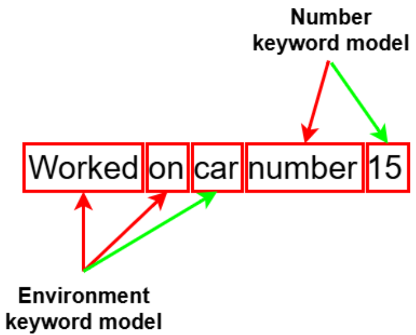
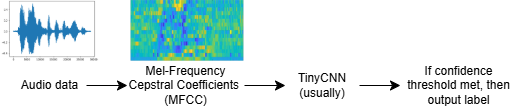
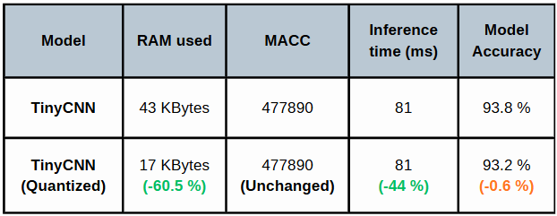

This project began at the end of my internship and continued during my full-time position. It demonstrated the feasibility of a fully on-device multi-keyword spotter running on the STM32L4-based iDETime device. The system combined an optimized signal-processing pipeline for lightweight feature extraction with compact Tiny models, enabling real-time inference within a strict 320 KB RAM constraint. The results were promising; however, the training data revealed limitations in handling non-ideal French keyword scenarios.

## Objectives

The work began with a rather vague set of goals: to implement a multi-keyword spotter algorithm capable of detecting both an environment keyword (e.g., car, room, office) and a number keyword within a given audio sample. Since no specific requirements were provided, I took the initiative to define high-level specifications. My objectives were to design a robust and highly efficient signal-processing and feature extraction pipeline (a key bottleneck previously identified in fall detection tasks) and to develop a novel method for detecting multiple keyword types using an optimized Tiny Neural Network. Naturally, achieving high word accuracy and maintaining a low memory footprint were essential goals. The ultimate target was, of course, the implementation on the MCU of the iDETime device itself.

## Method

For the multi-keyword spotter, we had several options. The ones I considered were the following:  
- A multi-head TinyCNN  
- Two separate TinyCNN models, one for each keyword type  

The choice of a TinyCNN was based on a detailed analysis of the most commonly used models within the scientific community. Other alternatives could include a TinyCNN hybrid combined with a GRU or an LSTM.  

For the multi-keyword spotter, I decided to start with two separate TinyCNN models, as they generally require less fine-tuning to achieve higher accuracy compared to a multi-head TinyCNN, where each head can affect the feature extraction part of the network.  

Below is the proposed multi-keyword pipeline:  

<figure style="max-width:800px; margin:0 auto 1.5em; text-align:center;">
  
  <figcaption><em>Figure 1.</em> Multi-keyword workflow.</figcaption>
</figure>  

The principle is as follows:  
- First, implement an algorithmic Voice Activity Detection (VAD) algorithm to split the speech into individual words.  
- On those segmented words, use the environment keyword TinyCNN to detect the environment keyword first.  
- If the environment keyword is recognized, record the word order and continue from that word with the number keyword spotter.  
- If the environment keyword is not recognized, restart from the beginning and attempt to detect at least a number using the number keyword spotter.  
- If no keyword is detected, indicate this through a speech-to-text (STT) message.  

It is important to ensure that a confidence threshold is met, for instance, a minimum confidence of 50–60% from the softmax output.  

Below is the pipeline for a single model (identical for both):  

<figure style="max-width:800px; margin:0 auto 1.5em; text-align:center;">
  
  <figcaption><em>Figure 2.</em> Generic Keyword spotting workflow.</figcaption>
</figure>  

Additional implementation details:  
- Apply post-training static quantization (FP32 → INT8).  
- Use depthwise-separable convolutions.  
- Perform MFCC parameter tuning with a scalarized multi-objective Bayesian Optimization (MOBO) to minimize overhead before inference (more details in the fall detection post).  

## Results (WIP)

Each TinyCNN model achieved very high accuracy and used the exact same topology, indicating effective feature extraction and a well-designed TinyCNN architecture, as shown in the table below:

<figure style="max-width:800px; margin:0 auto; text-align:center;">
  
  <figcaption><em>Figure 3.</em> TinyCNN optimization results.</figcaption>
</figure>

When implementing the multi-keyword spotter on phone-recorded audio samples and concatenated AI-generated samples, the method performed flawlessly so far. However, I have not yet had the opportunity to implement it on the MCU itself. Unfortunately, given the current situation of the company (with a high risk of liquidation), it is unlikely that I will be able to complete the implementation.

## What’s Next?

Although the model topology appears satisfactory at first glance, I prefer to avoid manual fine-tuning. Therefore, applying a Neural Architecture Search (NAS), specifically a hardware-aware NAS such as Hardware-DARTS or Proxy-NAS, could be a promising next step. Ideally, the implementation should also be completed and tested with a diverse group of users to evaluate its real-world viability, as well as profiled on the MCU to analyze its memory consumption and performance efficiency.

