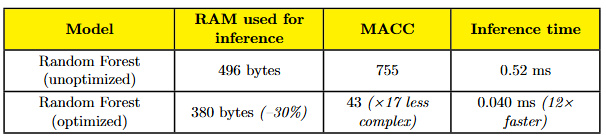

<head>
  
</head>

<h2>Summary</h2>

  This internship demonstrated the feasibility of fully on‑device fall detection on the STM32L4‑based iDETime badge, combining a tailor‑made signal‑processing pipeline, lightweight feature extraction, and real‑time inference of a TinyML model under a strict 320 KB RAM budget.

<h2>Objectives</h2>

  The work began with a clear set of goals: benchmark and compare different AI code‑generation frameworks for embedded deployment; design an efficient sliding‑window and interpolation pipeline to extract robust time‑ and frequency‑domain features. 
  
  Apply a multiobjective optimization strategy to balance predictive accuracy, memory footprint, and inference latency; and finally generate C libraries for seamless integration and profiling on the badge.

<h2>Method</h2>

  <figure style="max-width:800px; margin:0 auto; text-align:center;">
  
  <figcaption><em>Figure 1.</em> Overview of the signal‑processing and TinyML pipeline.</figcaption>
</figure>

<h2>AI Model</h2>

  Among several models, a Random Forest emerged as the best compromise. In its optimized form (five trees of maximum depth 25), it achieved 96.7 % balanced accuracy with an ONNX file of only 5 KB (versus 129 KB by default), while maintaining sub‑100 MACC complexity per inference.

</figure>

<h2>Implementation</h2>

  The chosen model was exported to C via X‑Cube‑AI and integrated into STM32CubeIDE. A free‑fall interrupt triggers capture of pre‑ and post‑fall data into a circular buffer, upon which the embedded feature‑extraction routines and normalized inference run in under 0.04 ms. Detected falls light up an SOS LED on the badge for immediate alert.

<h2>Results</h2>

  In a set of reproducible tests (ten falls per scenario), the system detected all simulated falls—whether low‑height or staircase‑style—without any false positives during normal activities. Memory usage peaked at just 60 % of the 320 KB RAM, and the badge’s IMU ran continuously in Ultra‑Low Power mode (~20 μA) at 104 Hz sampling.

<figure style="max-width:800px; margin:0 auto; text-align:center;">
  
  <figcaption><em>Figure 2.</em> Random Forest with and without our optimization workflow.</figcaption>

<h2>What’s Next?</h2>

  Future work will focus on adding continuous learning to adapt the model to individual users, expanding the test campaign in real‑world settings, and performing cycle‑by‑cycle profiling for deeper code‑level optimizations. Longer‑term, the same TinyML framework can be extended to fall classification, meta‑learning approaches for scarce data, and even on‑device voice or image recognition features.

