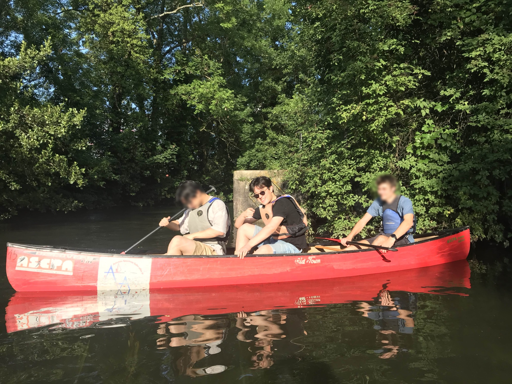

  

  
I completed my Master's degree in Mechatronics at the <a href="https://www.unistra.fr/">University of Strasbourg</a>, with a strong focus on embedded Artificial Intelligence at the edge (Edge AI) through hardware–software co-design.

  
During my internship at <a href="https://www.idemoov.fr/">iDEMoov</a>, my passion for the fascinating field of Edge AI deepened even further, especially since optimization has always been one of my key strengths.

  
As of November 12, 2025, I am pleased to announce that I will be beginning my research career with a PhD at <a href="https://www.fau.eu/">the University of Erlangen–Nuremberg</a> in the <a href="https://www.cs12.tf.fau.eu/">Hardware–Software Co-Design Department</a>. My research will focus on human–machine interaction (HMI), under the supervision of <a href="https://www.cs12.tf.fau.eu/person/juergen-teich/">Prof. Jürgen Teich</a> and <a href="https://www.cs12.tf.fau.eu/person/frank-hannig/">Dr. Frank Hannig</a>. I am eager to start this exciting journey in mid-January 2026 and prove myself as a capable and dedicated researcher.

  
When I’m not optimizing AIs, I enjoy racquet sports (especially table tennis), video games, cinema, water sports such as canoeing and kayaking, and I take great satisfaction in keeping everything meticulously clean.

  <figure style="max-width:800px; margin:0 auto; text-align:center;">
    
    <figcaption><em>The king of the rivers</em></figcaption>
  </figure>

